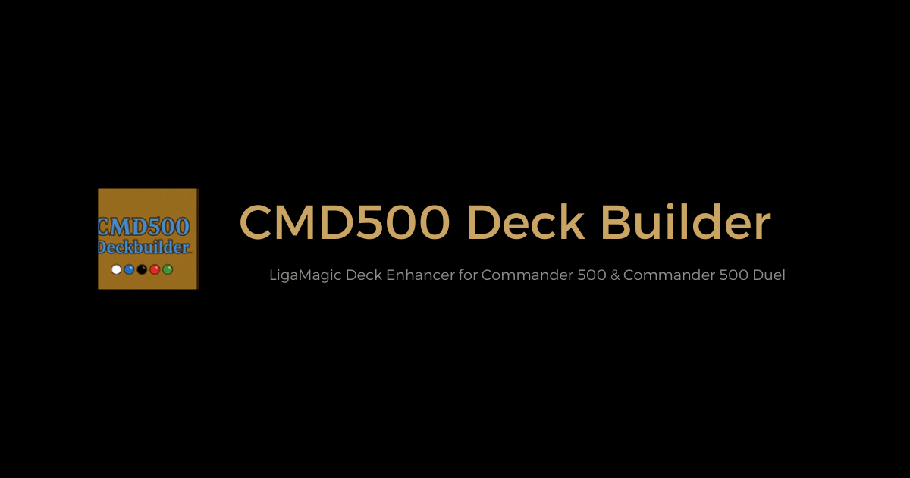
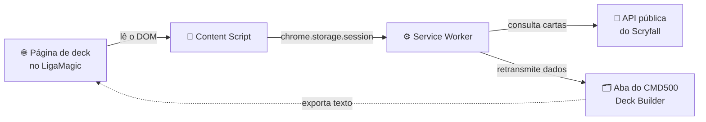
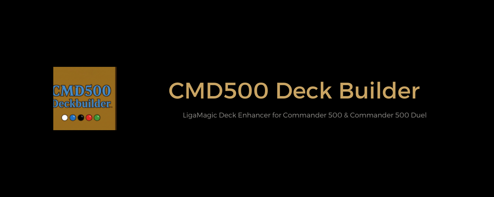
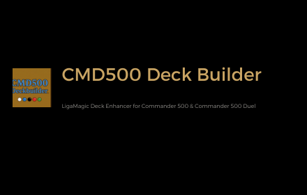

<div align="center">



# CMD500 Deck Builder — LigaMagic Deck Enhancer

[](LICENSE)


</div>

Uma extensão de navegador que transforma a página de um deck já montado no
[LigaMagic](https://www.ligamagic.com.br/) em um montador completo para os
formatos brasileiros **Commander 500** e **Commander 500 Duel** — orçamento
em tempo real, verificação de legalidade, organização por zonas com
arrastar e soltar, gráficos de composição e exportação, tudo rodando no seu
navegador, sem servidor próprio.

> [!IMPORTANT]
> Requer um deck já criado no editor do LigaMagic — esta extensão não cria
> decks do zero, ela melhora a página de um deck que você já montou lá.

## 🃏 O que é isto

O LigaMagic é o principal site brasileiro de compra/venda de cartas e
montagem de decks de Magic, mas seu editor não conhece as regras do
Commander 500 nem do Commander 500 Duel — formatos de orçamento populares
na comunidade brasileira, com teto de R$500 no deck e suas próprias listas
de banidos. O CMD500 Deck Builder lê a página do seu deck, já aberta no
LigaMagic, e adiciona por cima dela exatamente o que falta para jogar
nesses formatos.

Não é afiliado ao LigaMagic, à Wizards of the Coast ou ao Commander Rules
Committee. É uma ferramenta pessoal de montagem — não um serviço hospedado,
não um sistema de torneio.

## ⚙️ Como funciona

1. Você monta ou edita seu deck normalmente no LigaMagic.
2. Com a página do deck aberta, clica no ícone da extensão na barra de
   ferramentas do navegador.
3. O CMD500 Deck Builder abre em sua própria aba, já com seu deck
   carregado — comandante(s), deck principal e maybeboard, preços e arte,
   tudo lido diretamente da página que você tinha aberta.
4. Você organiza, verifica orçamento/legalidade e exporta — e pode voltar
   a exportar para o LigaMagic a qualquer momento, no formato exato que o
   importador dele espera.



## ✨ O que ele adiciona ao seu deck do LigaMagic

- 💰 **Orçamento do Commander 500** ao vivo: soma o menor preço do Deck
  Principal e do Comandante Parceiro (excluindo o comandante principal, o
  Maybeboard e terrenos básicos) contra o teto de R$500.
- ✅ **Verificação de legalidade**: Commander 500 usa a lista de banidos
  oficial do Commander (via Scryfall, sempre atualizada); Commander 500
  Duel usa a lista do Duel Commander, mantida com curadoria própria.
- 🗂️ **Quatro zonas organizáveis** — Comandante, Comandante Parceiro, Deck
  Principal, Maybeboard — com arrastar e soltar, ordem customizável e
  zonas recolhíveis.
- 👁️ **Duas visões**: Lista (compacta, com pré-visualização de arte ao
  passar o mouse) e Visual (miniaturas com arte), agrupáveis por Tipo, Cor
  ou Custo de Mana.
- 🔀 **Ordenação independente do agrupamento**: além de agrupar por Tipo,
  Cor ou Custo de Mana, cada zona pode ser ordenada por Valor de Mana,
  Nome, Cor ou Preço.
- 🔤 **Ícones de custo de mana na Lista**: cada carta mostra seu custo com
  os símbolos oficiais do LigaMagic, inclusive por face em cartas de dois
  lados ou custo dividido.
- 🔎 **Filtro por nome em cada zona**: Deck Principal e Maybeboard têm um
  campo de busca independente, sem afetar orçamento, contagem de cartas ou
  legalidade.
- 🗑️ **Remoção rápida de qualquer carta** com um clique, exceto o
  Comandante principal (que só sai sendo arrastado para outra zona).
- ⚠️ **Aviso ao vivo** quando o deck ultrapassa o limite de 99 cartas do
  Commander.
- 📊 **Gráficos** de curva de mana, cor e tipo do Deck Principal,
  recalculados a cada edição.
- ✏️ **Edição inline** de quantidade e preço, direto na lista.
- 🌐 **Toggle de idioma da carta** (EN ⇄ PT-BR): alterna o nome exibido
  entre o nome canônico em inglês e o nome em português do próprio
  LigaMagic — a exportação sempre usa o nome em inglês.
- 🌗 **Toggle de tema claro/escuro**: segue a preferência do seu sistema
  operacional por padrão e lembra sua escolha manual entre sessões.
- 📤 **Exportação em texto simples**, tanto no formato exato que o
  importador do LigaMagic espera quanto em uma versão legível com rótulos
  de zona.

## 📖 Como usar — casos de uso

**💰 Montar um Commander 500 dentro do orçamento**
Monte seu deck normalmente no LigaMagic. Abra-o no CMD500 Deck Builder e
deixe a barra de orçamento aberta enquanto troca cartas — cada
adição/remoção recalcula o total contra o teto de R$500 na hora, sem
precisar somar preços manualmente numa planilha à parte.

**🛡️ Conferir legalidade antes de um evento**
Antes de levar o deck para uma mesa de Commander 500 ou Duel, abra-o na
extensão e veja o resumo de legalidade: qualquer carta banida no formato
ativo aparece sinalizada, com a fonte (Scryfall para Commander 500, a
lista curada do Duel Commander para Commander 500 Duel).

**📈 Encontrar buracos na curva de mana**
Troque para a visão Visual, agrupe por Custo de Mana e olhe o gráfico de
curva ao lado — picos e vazios ficam óbvios sem precisar contar cartas na
mão.

**🔀 Reorganizar sem perder a exportação**
Arraste cartas entre Deck Principal, Maybeboard e Comandante Parceiro à
vontade, recolha zonas que não está editando no momento, e quando
terminar, exporte de volta no formato do LigaMagic para colar direto no
importador dele.

## 📦 Instalação

Este repositório tem um único pacote, `extension/`. O passo a passo completo de instalação e desenvolvimento — build, carregar como extensão descompactada no Chrome, rodar os testes, e os scripts de verificação manual contra o site real — está em **[`extension/README.md`](extension/README.md)**.

## 📣 Material promocional

Artes usadas em divulgação (ex.: uma futura listagem na Chrome Web Store), geradas a partir da identidade visual real da extensão.

<div align="center">

<br /><br />

</div>

## 🛠️ Seção técnica

### 🏗️ Arquitetura, em poucas palavras

Extensão Chrome (Manifest V3), sem backend próprio, em três partes:

1. **Content script** — só ativo em páginas do LigaMagic; lê o HTML da página (deck ou coleção) e captura cartas/zonas/preços/arte, sem injetar nenhuma UI na própria página.
2. **Service worker de background** — retransmite a captura para a aba de visualização (via `chrome.storage.session`, já que o content script não tem acesso direto a esse storage) e faz as chamadas à API pública do Scryfall para enriquecer as cartas (tipo, cor, CMC, legalidade) e resolver a lista de banidos do Duel Commander.
3. **Aba completa** (`tab.html`) — onde a UI de fato vive: organizador, orçamento, legalidade, gráficos e exportação, renderizados a partir dos dados retransmitidos, sem depender do documento da página de origem continuar aberto.

Nenhum servidor é mantido por este projeto. Os únicos serviços externos chamados são o próprio LigaMagic (via leitura de DOM, não API) e a API pública do Scryfall (para atributos de carta e legalidade — nunca para preço, que vem sempre do LigaMagic).

### 📁 Estrutura do repositório

```text
extension/           a extensão em si — código-fonte, testes, scripts de build e verificação
  src/lib/            lógica pura, sem UI (captura, orçamento, legalidade, organização, exportação)
  src/ui/             componentes React
  src/tab/            a página de aba completa e seus hooks de dados
  src/background/     service worker
  src/content/        content script
  test/fixtures/      HTML real capturado do LigaMagic, usado nos testes
  scripts/            build e scripts de verificação manual via Playwright
openspec/            especificações e histórico de decisões
  specs/               o comportamento atual do sistema, por capacidade
  changes/             mudanças em andamento (proposta, specs delta, design, tarefas)
  changes/archive/     mudanças já concluídas e mescladas às specs principais
```

### 🧪 Testes e verificação

`npm test`/`npm run typecheck` (unitário/componente, sem rede) e os scripts de verificação manual via Playwright contra o site real estão documentados em [`extension/README.md`](extension/README.md#rodando-os-testes).

### 🤝 Contribuindo

Issues e pull requests são bem-vindos. Este projeto usa [OpenSpec](openspec/) para mudanças não-triviais — decisões de arquitetura relevantes ficam registradas em `openspec/changes/` (mudanças em andamento) ou `openspec/changes/archive/` (já concluídas), cada uma com seu próprio `design.md` explicando o racional e as alternativas consideradas. Para uma contribuição pequena (correção de bug, ajuste de UI), um PR direto com testes já basta; para algo que muda comportamento ou arquitetura, um bom começo é abrir uma issue descrevendo o problema antes do código.

### 📄 Licença

Este projeto é licenciado sob a [GPL-3.0](LICENSE) — qualquer fork ou redistribuição precisa permanecer com código aberto sob a mesma licença.
